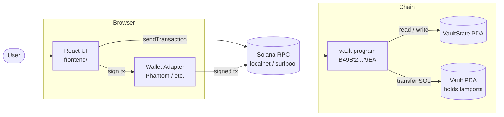
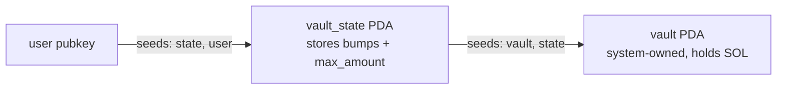
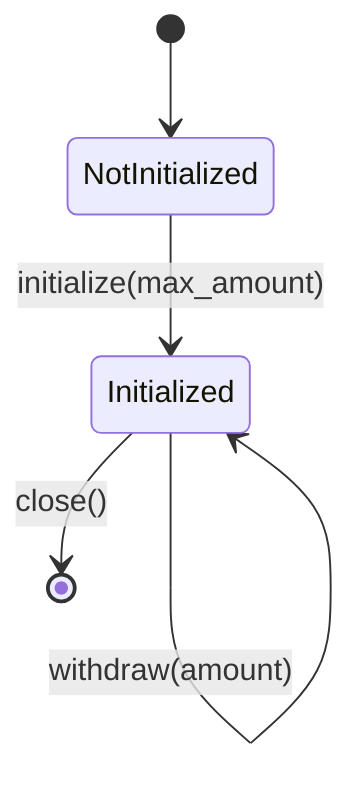
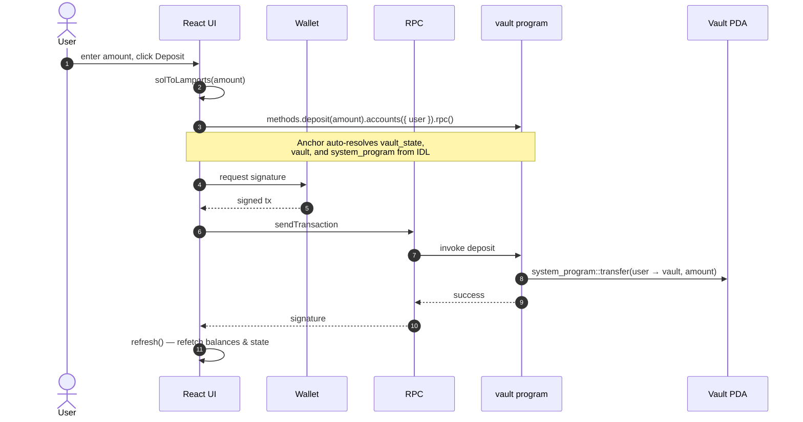

# Vault

A Solana Anchor program with a React frontend. Each wallet gets a single PDA-controlled vault: deposit SOL, withdraw it back, close the vault to reclaim rent. The vault can optionally enforce a per-vault cap (`max_amount`).

## Architecture



## Program

Instructions:

| Instruction  | Args                      | Effect                                                     |
| ------------ | ------------------------- | ---------------------------------------------------------- |
| `initialize` | `max_amount: Option<u64>` | Creates the vault state PDA and the vault PDA for `user`.  |
| `deposit`    | `amount: u64`             | Transfers `amount` lamports from `user` to the vault.      |
| `withdraw`   | `amount: u64`             | Transfers `amount` lamports from the vault back to `user`. |
| `close`      | —                         | Drains the vault into `user` and closes the state PDA.     |

PDAs:

- `vault_state` = `["state", user]`
- `vault` = `["vault", vault_state]`



### Vault lifecycle



## Running tests

Tests use Vitest and require a running validator with the program deployed.

```sh
# Typescript tests
anchor test

# LiteSVM tests
anchor testsvm
```

### Deposit flow



## Running the frontend

1. Start a local validator (pick one):

    ```sh
    solana-test-validator
    # or
    surfpool
    ```

2. Deploy the program:

    ```sh
    anchor deploy
    ```

3. Set the RPC endpoint and run the dev server:

    ```sh
    echo 'VITE_RPC_URL=http://127.0.0.1:8899' > .env.local
    yarn dev
    ```

4. Open the printed URL, connect a wallet (Phantom etc. set to "Localnet"), and you should see your balance and the vault controls.

### Build / lint / format

```sh
yarn build
yarn typecheck
yarn lint
yarn format
yarn format:check
```
